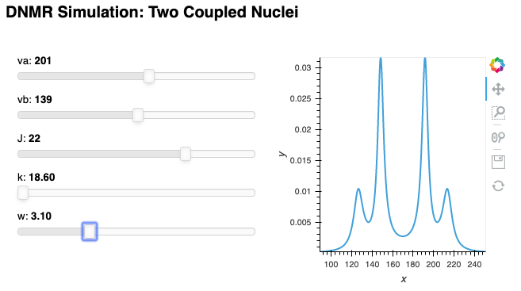

## Click the "launch binder app" badge above to launch the application. 
Be patient as the server image is launched :)

# panel-test

Testing the use of Panel to create apps for simulating nuclear magnetic 
resonance (NMR) simulations.

Currently the demo has one simulation: a dynamic NMR (DNMR) simulation for two
coupled spin-1/2 nuclei (an AB quartet at the slow-exchange limit).

* **va** and **vb** are the frequencies of the two nuclei (in the absence of 
exchange
 and coupling) in Hz
* **J** is the coupling constant in Hz
* **k** is the rate constant for the exchange (in s-1)
* **w** is the peak width at half height (at the slow-exchange limit)
